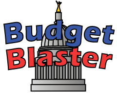

  

    
  

# Budget Blaster

Budget Blaster was a little web based game experiment that was done during the Scott Walker collective bargaining dispute and recall election in 2012.  

 

# Educational Features

Budget Blaster explored the presentation of a number of educational elements including:

### Issue Awareness

The game explored a way to present the issues involved in the dispute in an engaging way.  

 

### Political Awareness

The game provided a way learn about our democratic legislators. 

 

### Political Contribution Awareness

The game presented actual financial data about compaign contributions in a way where this is incorporated into the game play.

 

# Technical Features

This Javascript presented an opportunity to explore the following technical features:

### Parallax Scrolling

The layered backgrounds used parallax scrolling for a 3D motion effect.

 

### SVG Illustration

All graphics in this game were drawn by me, then digitized and converted to vector game graphics using Adobe Illustrator.

 

<!-- LICENSE -->

# License

Distributed under the MIT license which allows urestricted use of the software. See [LICENSE.txt](LICENSE.txt) for more information.

<!-- CONTACT -->

# Contact

Abe Megahed - (mailto:amegahed@wisc.edu) - email